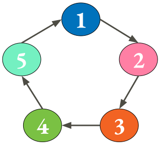

# Neodev the game
This is an internal project at Neodev AB(neodev.se).

## General Description
**Can you beat the project or will it beat you?**  
NeoGame is a web based 2 player card game, where one player takes the role of the development team and the other(the computer) will play as the dreaded IT-project.

## Rules
### Setup
The shared deck consists of five classes with five cards from each class, a total of 25 cards. Each class has two mirror images depending on 
whether the player/computer acts as the team or the project.  

 The Team | The Project 
----------|:------------
Product owner (Produktägare) | Bugg 
Scrummaster | Specification (Krav)
Architect (Arkitekt) | Process
Developer (Utvecklare) | Design
Tester | Code

### Game play
For each round the deck is shuffled then each player receives two cards lying face-up and a hand of five cards. The players then selects two cards from their hand and places them face-down. Once both players have placed their cards they are flipped to face-up. The players score is then calculated as follows: For each card one point is rewarded for everyone of the opponent's card that it beats. Cards beat each other according to a circle chain where level one cards (Bugg/Product owner) beats level two cards (Scrummaster/Specifications) and so on. 

 

## Current status: Live at http://cardgame.neodev.se/

## To run locally:
1. Install yarn/npm
1. In Web-folder run: yarn/npm build
1. In root run: pip install -r requirements.txt
1. In root run: python run_flask.py --env dev (if development otherwise prod)
